

  

  
  
  
  
    
  

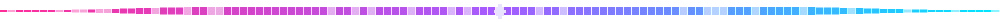

  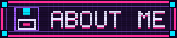

<table>
<tr>
<td width="56%" valign="top">

**Barış Yeşildağ** — Computer Engineer · Türkiye · UTC+3

I build things that learn, and the products that carry them. My work runs the
whole board: convolutional networks that read medical images, RAG assistants
that cite their sources, and the web and mobile apps that make them usable.

`AI / ML` · `NLP` · `RAG pipelines` · `Full-Stack`

**▸ Now** — new grad, open to software & AI roles.

**▸ How I learn** — by shipping. Every project below started as a question I
wanted to answer, and ended up deployed.

**▸ Off duty** — I play acoustic guitar and produce electronic music. It is the
same instinct as writing software: build a structure, then find out what it
actually sounds like.

</td>
<td width="44%" align="center" valign="top">


</td>
</tr>
</table>

  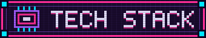

<table>
<tr>
  <td align="right">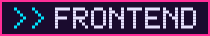</td>
  <td></td>
</tr>
<tr>
  <td align="right">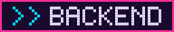</td>
  <td></td>
</tr>
<tr>
  <td align="right">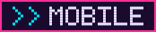</td>
  <td></td>
</tr>
<tr>
  <td align="right">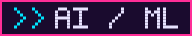</td>
  <td>
     
    
    
    
  </td>
</tr>
<tr>
  <td align="right">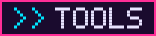</td>
  <td></td>
</tr>
</table>

  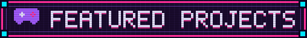

<table>
<tr>

<td width="50%" valign="top">
<a href="https://github.com/barisyesil/reliable-academic-assistant">
  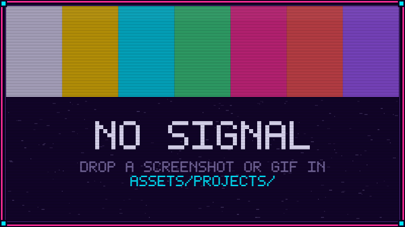
</a>
<h3>Reliable Academic Assistant</h3>

An LLM + RAG assistant built for trust: academic answers grounded in
retrieved sources instead of hallucinations.

<code>LLM</code> <code>RAG</code> <code>Python</code>

  <a href="https://github.com/barisyesil/reliable-academic-assistant"><b>CODE →</b></a>

</td>

<td width="50%" valign="top">

<h3>Dev Quest — Portfolio RPG</h3>

A retro 2D world you can actually walk through — skills and projects hidden
in the map like loot.

<code>JavaScript</code> <code>Canvas</code> <code>Pixel art</code>

  <a href="https://github.com/barisyesil/Dev-Quest-Portfolio-RPG"><b>CODE →</b></a> ·
  <a href="https://devquest-indol.vercel.app"><b>PLAY →</b></a>

</td>

</tr>
<tr>

<td width="50%" valign="top">

<h3>FlowForge</h3>

Multi-step wizard forms meet business process management: design a flow once,
then run and track it end to end.

<code>Next.js</code> <code>TypeScript</code> <code>.NET 8</code>

  <a href="https://github.com/barisyesil/flowforge"><b>CODE →</b></a>

</td>

<td width="50%" valign="top">

<h3>İzem Apart</h3>

Premium, mobile-first redesign for a student residence — fast pages, clear
room info and a booking-focused flow.

<code>Next.js 16</code> <code>Tailwind v4</code> <code>TypeScript</code>

  <a href="https://github.com/barisyesil/izem-apart"><b>CODE →</b></a> ·
  <a href="https://izem-apart.vercel.app"><b>LIVE →</b></a>

</td>

</tr>
<tr>

<td width="50%" valign="top">

<h3>Smart Restaurant Finder</h3>

Detects where you are, maps the restaurants and cafés around you in real
time, and learns what you like.

<code>TypeScript</code> <code>React</code> <code>Geolocation</code>

  <a href="https://github.com/barisyesil/smart-restaurant-finder"><b>CODE →</b></a> ·
  <a href="https://smart-restaurant-finder-neon.vercel.app"><b>LIVE →</b></a>

</td>

<td width="50%" valign="top">

<h3>All-in-One Party Games</h3>

A single phone, a room full of people: a Flutter app that packs one-device
party games into one place.

<code>Flutter</code> <code>Dart</code> <code>Mobile</code>

  <a href="https://github.com/barisyesil/all_in_one_party_games"><b>CODE →</b></a>

</td>

</tr>
</table>

<!-- ═══════════════════════════════════════════════════════════════════
     ADD A PROJECT — copy this whole <td> block into the table above.
     Two cells per <tr>; start a new <tr>...</tr> after every two.

     1. Drop a 16:9 image or GIF (800x450 works well) into
        assets/projects/  and point the  at it.
     2. Until you have one, leave _placeholder.svg — it renders as a
        deliberate "NO SIGNAL" CRT card rather than a broken image.
     3. Delete the LIVE line if the project is not deployed.

<td width="50%" valign="top">

<h3>PROJECT NAME</h3>

One or two sentences. Say what it does and who it is for.

<code>Tech</code> <code>Tech</code> <code>Tech</code>

  <a href="REPO_URL"><b>CODE →</b></a> ·
  <a href="LIVE_URL"><b>LIVE →</b></a>

</td>
     ═══════════════════════════════════════════════════════════════════ -->

  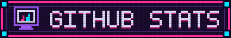

  
  

    

  

  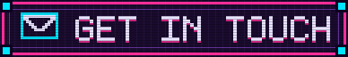

Full-time roles, research, collaborations — or just a good conversation about
models and products. My inbox is open.

  
  
  
  

 

  

<!-- CONTRIBUTION SNAKE — enable after the first Actions run.
     See GUIDE.md > "Turning on the contribution snake", then delete the
     comment markers around the block below.

  

-->
